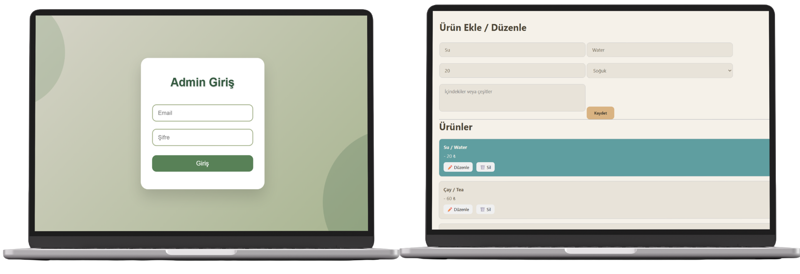
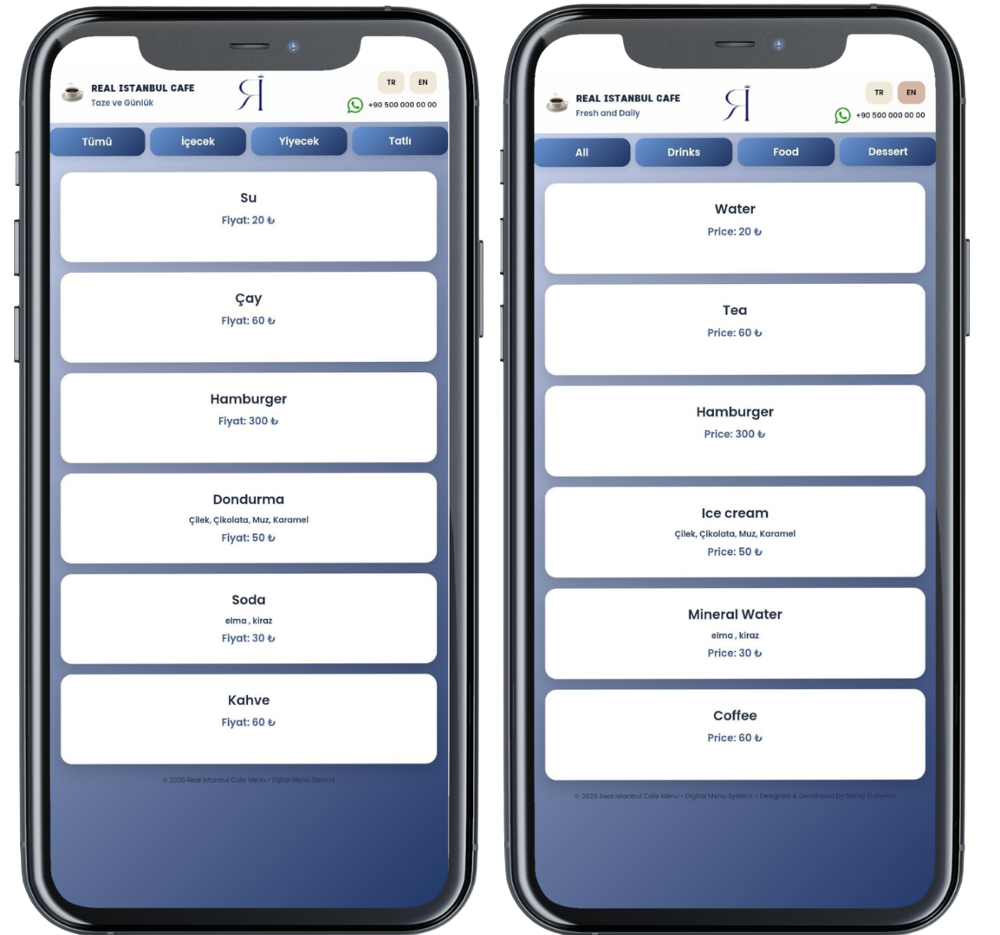

# RIstanbulCafeMenu

## ⚙️Created with
     

## Digital QR Menu & Admin Management System

RIstanbulCafeMenu is a modern web-based digital menu solution designed for cafés and restaurants.  
Customers access the menu instantly via QR code, while administrators manage all content through a secure dashboard powered by Firebase.

---

## 🌐 Live Demo

👉 **[Click here to see the live demo](https://lightlymoon.github.io/RIstanbulCafeMenu/)**

---

# 📱 User Interface Preview

## Desktop Views 

---

## Mobile Views

  

# 🚀 Features

## Customer Side (Frontend)

- QR code direct access
- Dynamic category structure
- Multi-language support
- Responsive design
- Real-time data updates
---

## Admin Panel (Dashboard)

- Secure login system (Firebase Authentication)
- Category management
- Product creation, editing, and deletion
- Real-time synchronization with Firestore
- Clean and structured dashboard interface

---

# 🔐 Authentication System

The admin panel is protected using **Firebase Authentication**.

Only authorized users can:

- Access the dashboard
- Modify menu content
- Upload or delete product data
- Manage categories

All authentication and session handling are securely managed through Firebase.

---

## ⭐ Support ⭐ 
⋆⭒˚.⋆ If you like this project, do not forget to give a star ⋆⭒˚.⋆

  ⚠️ This README is uniquely designed by <strong>@lightlymoon.</strong>

